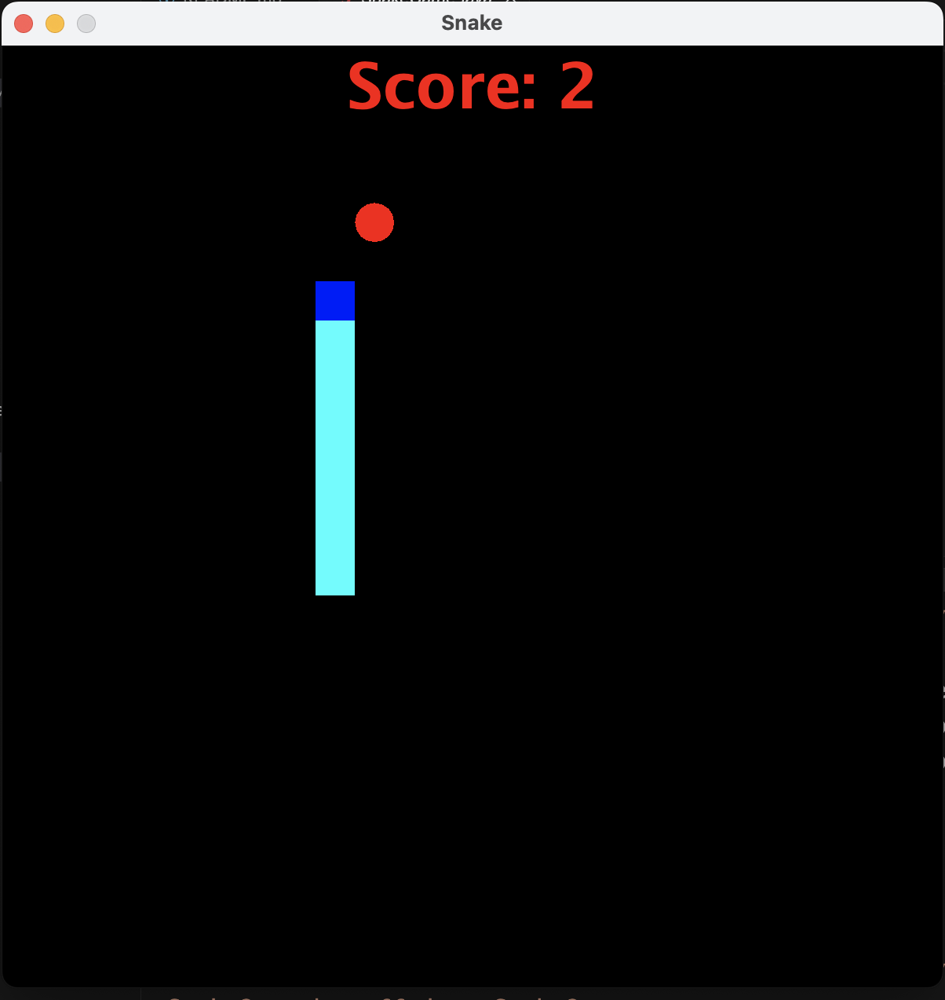
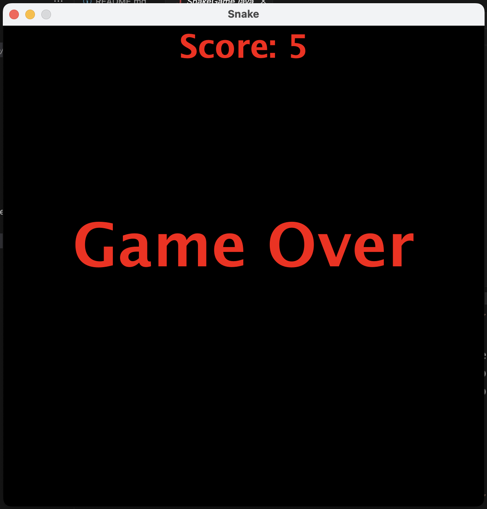

# Snake Game built in Java

## Thursday 4th April

I've been trying to increase my knowledge of Java and get a better understanding of when to implement methods and new classes, etc. I thought a fun way would be to do a code-along.

### What I Learned

- **Using JFrame:** It was the first time I was exposed to the use of `JFrame`, which made things a little more exciting due to the visuals. I learned how to create a graphical window for the game and manage its properties.
- **Styling with Graphics:** I learned a bit more about styling using Java's `Graphics` class. It was interesting to see how to draw shapes, text, and colours on the screen to create a visually appealing game interface.
- **Game Logic:** Additionally, it was good to work with the game logic. I tend to write long-formatted code, and it was helpful to see short and precise examples for the movement and creation of the game board.

### Source

The code-along tutorial I followed for building the Snake game can be found on [YouTube](https://www.youtube.com/watch?v=bI6e6qjJ8JQ&ab_channel=BroCode).
